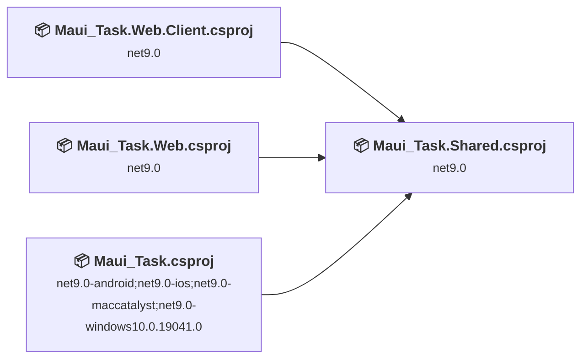
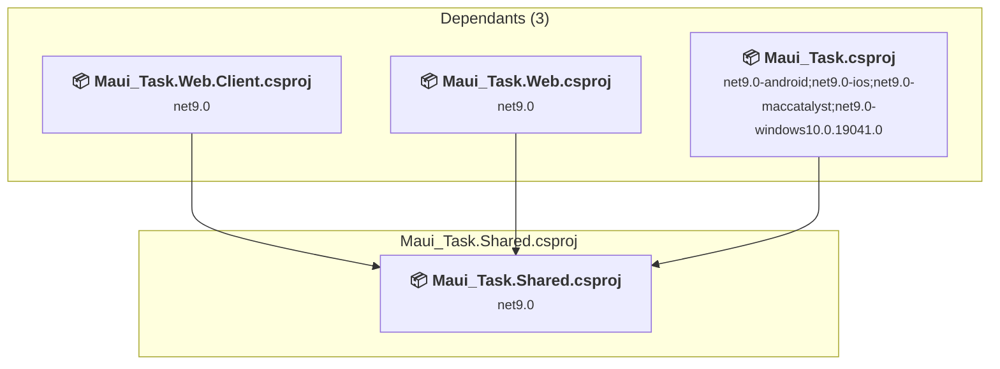
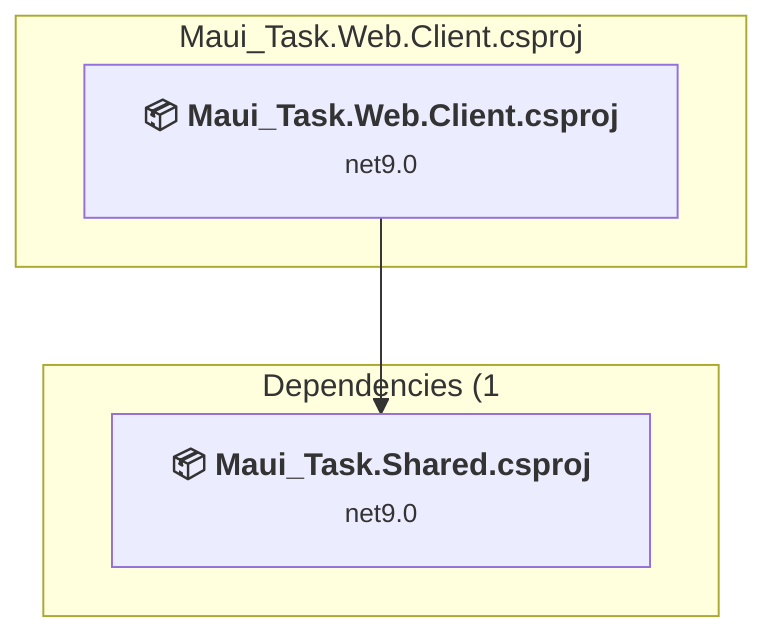
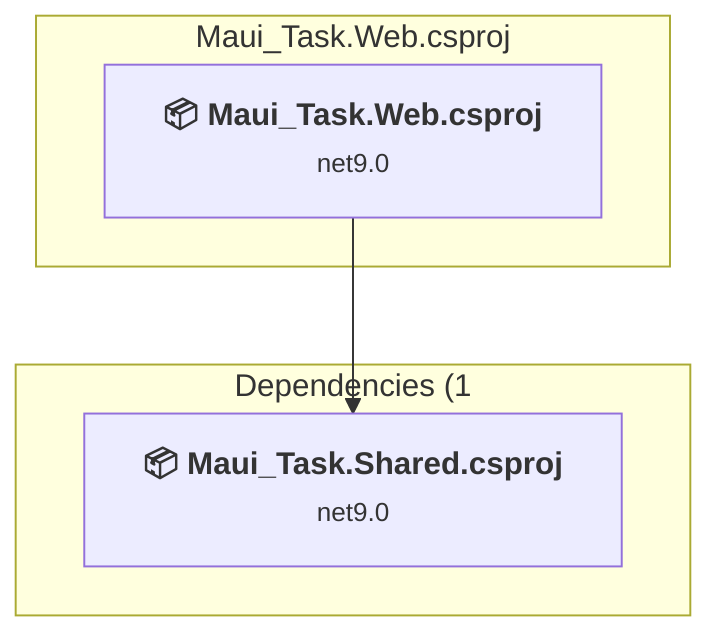
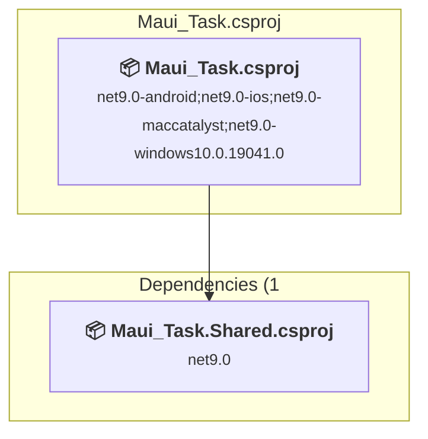

# Projects and dependencies analysis

This document provides a comprehensive overview of the projects and their dependencies in the context of upgrading to .NETCoreApp,Version=v10.0.

## Table of Contents

- [Executive Summary](#executive-Summary)
  - [Highlevel Metrics](#highlevel-metrics)
  - [Projects Compatibility](#projects-compatibility)
  - [Package Compatibility](#package-compatibility)
  - [API Compatibility](#api-compatibility)
- [Aggregate NuGet packages details](#aggregate-nuget-packages-details)
- [Top API Migration Challenges](#top-api-migration-challenges)
  - [Technologies and Features](#technologies-and-features)
  - [Most Frequent API Issues](#most-frequent-api-issues)
- [Projects Relationship Graph](#projects-relationship-graph)
- [Project Details](#project-details)

  - [Maui_Task\Maui_Task.Shared\Maui_Task.Shared.csproj](#maui_taskmaui_tasksharedmaui_tasksharedcsproj)
  - [Maui_Task\Maui_Task.Web.Client\Maui_Task.Web.Client.csproj](#maui_taskmaui_taskwebclientmaui_taskwebclientcsproj)
  - [Maui_Task\Maui_Task.Web\Maui_Task.Web.csproj](#maui_taskmaui_taskwebmaui_taskwebcsproj)
  - [Maui_Task\Maui_Task\Maui_Task.csproj](#maui_taskmaui_taskmaui_taskcsproj)

## Executive Summary

### Highlevel Metrics

| Metric | Count | Status |
| :--- | :---: | :--- |
| Total Projects | 4 | All require upgrade |
| Total NuGet Packages | 19 | 14 need upgrade |
| Total Code Files | 174 |  |
| Total Code Files with Incidents | 27 |  |
| Total Lines of Code | 9915 |  |
| Total Number of Issues | 193 |  |
| Estimated LOC to modify | 174+ | at least 1.8% of codebase |

### Projects Compatibility

| Project | Target Framework | Difficulty | Package Issues | API Issues | Est. LOC Impact | Description |
| :--- | :---: | :---: | :---: | :---: | :---: | :--- |
| [Maui_Task\Maui_Task.Shared\Maui_Task.Shared.csproj](#maui_taskmaui_tasksharedmaui_tasksharedcsproj) | net9.0 | 🟢 Low | 6 | 22 | 22+ | ClassLibrary, Sdk Style = True |
| [Maui_Task\Maui_Task.Web.Client\Maui_Task.Web.Client.csproj](#maui_taskmaui_taskwebclientmaui_taskwebclientcsproj) | net9.0 | 🟢 Low | 1 | 4 | 4+ | AspNetCore, Sdk Style = True |
| [Maui_Task\Maui_Task.Web\Maui_Task.Web.csproj](#maui_taskmaui_taskwebmaui_taskwebcsproj) | net9.0 | 🟢 Low | 7 | 29 | 29+ | AspNetCore, Sdk Style = True |
| [Maui_Task\Maui_Task\Maui_Task.csproj](#maui_taskmaui_taskmaui_taskcsproj) | net9.0-android;net9.0-ios;net9.0-maccatalyst;net9.0-windows10.0.19041.0 | 🟢 Low | 1 | 119 | 119+ | ClassLibrary, Sdk Style = True |

### Package Compatibility

| Status | Count | Percentage |
| :--- | :---: | :---: |
| ✅ Compatible | 5 | 26.3% |
| ⚠️ Incompatible | 2 | 10.5% |
| 🔄 Upgrade Recommended | 12 | 63.2% |
| ***Total NuGet Packages*** | ***19*** | ***100%*** |

### API Compatibility

| Category | Count | Impact |
| :--- | :---: | :--- |
| 🔴 Binary Incompatible | 11 | High - Require code changes |
| 🟡 Source Incompatible | 131 | Medium - Needs re-compilation and potential conflicting API error fixing |
| 🔵 Behavioral change | 32 | Low - Behavioral changes that may require testing at runtime |
| ✅ Compatible | 22147 |  |
| ***Total APIs Analyzed*** | ***22321*** |  |

## Aggregate NuGet packages details

| Package | Current Version | Suggested Version | Projects | Description |
| :--- | :---: | :---: | :--- | :--- |
| AutoMapper.Extensions.Microsoft.DependencyInjection | 12.0.1 |  | [Maui_Task.Web.csproj](#maui_taskmaui_taskwebmaui_taskwebcsproj) | ⚠️NuGet package is deprecated |
| BCrypt.Net-Next | 4.1.0 |  | [Maui_Task.Web.csproj](#maui_taskmaui_taskwebmaui_taskwebcsproj) | ✅Compatible |
| FluentValidation.AspNetCore | 11.3.1 |  | [Maui_Task.Web.csproj](#maui_taskmaui_taskwebmaui_taskwebcsproj) | ⚠️NuGet package is deprecated |
| MailKit | 4.3.0 |  | [Maui_Task.Web.csproj](#maui_taskmaui_taskwebmaui_taskwebcsproj) | ✅Compatible |
| Microsoft.AspNetCore.Authentication.JwtBearer | 9.0.0 | 10.0.5 | [Maui_Task.Web.csproj](#maui_taskmaui_taskwebmaui_taskwebcsproj) | NuGet package upgrade is recommended |
| Microsoft.AspNetCore.Components.Authorization | 9.0.0 | 10.0.5 | [Maui_Task.Shared.csproj](#maui_taskmaui_tasksharedmaui_tasksharedcsproj) | NuGet package upgrade is recommended |
| Microsoft.AspNetCore.Components.Web | 9.0.0 | 10.0.5 | [Maui_Task.Shared.csproj](#maui_taskmaui_tasksharedmaui_tasksharedcsproj) | NuGet package upgrade is recommended |
| Microsoft.AspNetCore.Components.WebAssembly | 9.0.0 | 10.0.5 | [Maui_Task.Web.Client.csproj](#maui_taskmaui_taskwebclientmaui_taskwebclientcsproj) | NuGet package upgrade is recommended |
| Microsoft.AspNetCore.Components.WebAssembly.Server | 9.0.0 | 10.0.5 | [Maui_Task.Web.csproj](#maui_taskmaui_taskwebmaui_taskwebcsproj) | NuGet package upgrade is recommended |
| Microsoft.AspNetCore.Components.WebView.Maui | 9.0.0 |  | [Maui_Task.csproj](#maui_taskmaui_taskmaui_taskcsproj) | ✅Compatible |
| Microsoft.AspNetCore.Mvc.NewtonsoftJson | 9.0.0 | 10.0.5 | [Maui_Task.Web.csproj](#maui_taskmaui_taskwebmaui_taskwebcsproj) | NuGet package upgrade is recommended |
| Microsoft.AspNetCore.SignalR.Client | 9.0.0 | 10.0.5 | [Maui_Task.Shared.csproj](#maui_taskmaui_tasksharedmaui_tasksharedcsproj) | NuGet package upgrade is recommended |
| Microsoft.EntityFrameworkCore | 9.0.0 | 10.0.5 | [Maui_Task.Shared.csproj](#maui_taskmaui_tasksharedmaui_tasksharedcsproj) [Maui_Task.Web.csproj](#maui_taskmaui_taskwebmaui_taskwebcsproj) | NuGet package upgrade is recommended |
| Microsoft.EntityFrameworkCore.Design | 9.0.0 | 10.0.5 | [Maui_Task.Web.csproj](#maui_taskmaui_taskwebmaui_taskwebcsproj) | NuGet package upgrade is recommended |
| Microsoft.EntityFrameworkCore.Sqlite | 9.0.0 | 10.0.5 | [Maui_Task.Shared.csproj](#maui_taskmaui_tasksharedmaui_tasksharedcsproj) | NuGet package upgrade is recommended |
| Microsoft.EntityFrameworkCore.Tools | 9.0.0 | 10.0.5 | [Maui_Task.Shared.csproj](#maui_taskmaui_tasksharedmaui_tasksharedcsproj) | NuGet package upgrade is recommended |
| Microsoft.Extensions.Logging.Debug | 9.0.0 | 10.0.5 | [Maui_Task.csproj](#maui_taskmaui_taskmaui_taskcsproj) | NuGet package upgrade is recommended |
| Microsoft.Maui.Controls | 9.0.0 |  | [Maui_Task.csproj](#maui_taskmaui_taskmaui_taskcsproj) | ✅Compatible |
| Swashbuckle.AspNetCore | 6.5.0 |  | [Maui_Task.Web.csproj](#maui_taskmaui_taskwebmaui_taskwebcsproj) | ✅Compatible |

## Top API Migration Challenges

### Technologies and Features

| Technology | Issues | Percentage | Migration Path |
| :--- | :---: | :---: | :--- |
| IdentityModel & Claims-based Security | 5 | 2.9% | Windows Identity Foundation (WIF), SAML, and claims-based authentication APIs that have been replaced by modern identity libraries. WIF was the original identity framework for .NET Framework. Migrate to Microsoft.IdentityModel.* packages (modern identity stack). |

### Most Frequent API Issues

| API | Count | Percentage | Category |
| :--- | :---: | :---: | :--- |
| T:Microsoft.Maui.Controls.BindingMode | 20 | 11.5% | Source Incompatible |
| P:Microsoft.Maui.Hosting.MauiAppBuilder.Services | 14 | 8.0% | Source Incompatible |
| T:System.Uri | 14 | 8.0% | Behavioral Change |
| T:Microsoft.Maui.Storage.SecureStorage | 10 | 5.7% | Source Incompatible |
| T:System.Net.Http.HttpContent | 8 | 4.6% | Behavioral Change |
| T:Microsoft.Maui.Hosting.MauiApp | 5 | 2.9% | Source Incompatible |
| M:Microsoft.Maui.Storage.SecureStorage.Remove(System.String) | 4 | 2.3% | Source Incompatible |
| M:Microsoft.Maui.Storage.SecureStorage.SetAsync(System.String,System.String) | 4 | 2.3% | Source Incompatible |
| M:System.Uri.#ctor(System.String) | 4 | 2.3% | Behavioral Change |
| F:Microsoft.Maui.Controls.BindingMode.TwoWay | 3 | 1.7% | Source Incompatible |
| F:Microsoft.Maui.Controls.BindingMode.OneWayToSource | 3 | 1.7% | Source Incompatible |
| T:Microsoft.Maui.Devices.DeviceInfo | 3 | 1.7% | Source Incompatible |
| T:Microsoft.Maui.Hosting.MauiAppBuilder | 3 | 1.7% | Source Incompatible |
| F:Microsoft.Maui.Controls.BindingMode.Default | 2 | 1.1% | Source Incompatible |
| P:Microsoft.Maui.Controls.BindableProperty.DefaultBindingMode | 2 | 1.1% | Source Incompatible |
| M:Microsoft.Maui.Storage.SecureStorage.GetAsync(System.String) | 2 | 1.1% | Source Incompatible |
| T:Microsoft.Maui.Controls.Xaml.Extensions | 2 | 1.1% | Source Incompatible |
| M:Microsoft.Maui.Controls.ContentPage.#ctor | 2 | 1.1% | Source Incompatible |
| M:Microsoft.Maui.MauiApplication.#ctor(System.IntPtr,Android.Runtime.JniHandleOwnership) | 2 | 1.1% | Binary Incompatible |
| T:Microsoft.Maui.Controls.Window | 2 | 1.1% | Source Incompatible |
| M:Microsoft.Maui.Controls.Application.#ctor | 2 | 1.1% | Source Incompatible |
| T:System.Text.Json.JsonDocument | 2 | 1.1% | Behavioral Change |
| M:System.TimeSpan.FromMinutes(System.Int64) | 2 | 1.1% | Source Incompatible |
| P:System.Environment.OSVersion | 2 | 1.1% | Behavioral Change |
| P:Microsoft.AspNetCore.Authentication.JwtBearer.MessageReceivedContext.Token | 2 | 1.1% | Source Incompatible |
| T:Microsoft.AspNetCore.Authentication.JwtBearer.JwtBearerEvents | 2 | 1.1% | Source Incompatible |
| T:Microsoft.AspNetCore.Authentication.JwtBearer.JwtBearerDefaults | 2 | 1.1% | Source Incompatible |
| F:Microsoft.AspNetCore.Authentication.JwtBearer.JwtBearerDefaults.AuthenticationScheme | 2 | 1.1% | Source Incompatible |
| T:Microsoft.Maui.Controls.BindableProperty | 1 | 0.6% | Source Incompatible |
| P:Microsoft.Maui.Devices.DeviceInfo.VersionString | 1 | 0.6% | Source Incompatible |
| T:Microsoft.Maui.Devices.DevicePlatform | 1 | 0.6% | Source Incompatible |
| P:Microsoft.Maui.Devices.DeviceInfo.Platform | 1 | 0.6% | Source Incompatible |
| M:Microsoft.Maui.Devices.DevicePlatform.ToString | 1 | 0.6% | Source Incompatible |
| T:Microsoft.Maui.Devices.DeviceIdiom | 1 | 0.6% | Source Incompatible |
| P:Microsoft.Maui.Devices.DeviceInfo.Idiom | 1 | 0.6% | Source Incompatible |
| M:Microsoft.Maui.Devices.DeviceIdiom.ToString | 1 | 0.6% | Source Incompatible |
| T:Microsoft.Maui.Storage.FileSystem | 1 | 0.6% | Source Incompatible |
| P:Microsoft.Maui.Storage.FileSystem.AppDataDirectory | 1 | 0.6% | Source Incompatible |
| T:Microsoft.Maui.Controls.NameScopeExtensions | 1 | 0.6% | Source Incompatible |
| M:Microsoft.Maui.Controls.NameScopeExtensions.FindByName''1(Microsoft.Maui.Controls.Element,System.String) | 1 | 0.6% | Source Incompatible |
| T:Microsoft.Maui.Controls.ContentPage | 1 | 0.6% | Source Incompatible |
| T:Microsoft.Maui.MauiApplication | 1 | 0.6% | Binary Incompatible |
| M:Microsoft.Maui.MauiAppCompatActivity.#ctor | 1 | 0.6% | Binary Incompatible |
| T:Microsoft.Maui.MauiAppCompatActivity | 1 | 0.6% | Binary Incompatible |
| P:Microsoft.Maui.Hosting.MauiApp.Services | 1 | 0.6% | Source Incompatible |
| M:Microsoft.Maui.Hosting.MauiAppBuilder.Build | 1 | 0.6% | Source Incompatible |
| P:Microsoft.Maui.Hosting.MauiAppBuilder.Logging | 1 | 0.6% | Source Incompatible |
| T:Microsoft.Maui.Hosting.FontCollectionExtensions | 1 | 0.6% | Source Incompatible |
| T:Microsoft.Maui.Hosting.IFontCollection | 1 | 0.6% | Source Incompatible |
| M:Microsoft.Maui.Hosting.FontCollectionExtensions.AddFont(Microsoft.Maui.Hosting.IFontCollection,System.String,System.String) | 1 | 0.6% | Source Incompatible |

## Projects Relationship Graph

Legend:
📦 SDK-style project
⚙️ Classic project

## Project Details

### Maui_Task\Maui_Task.Shared\Maui_Task.Shared.csproj

#### Project Info

- **Current Target Framework:** net9.0
- **Proposed Target Framework:** net10.0
- **SDK-style**: True
- **Project Kind:** ClassLibrary
- **Dependencies**: 0
- **Dependants**: 3
- **Number of Files**: 125
- **Number of Files with Incidents**: 7
- **Lines of Code**: 3824
- **Estimated LOC to modify**: 22+ (at least 0.6% of the project)

#### Dependency Graph

Legend:
📦 SDK-style project
⚙️ Classic project

### API Compatibility

| Category | Count | Impact |
| :--- | :---: | :--- |
| 🔴 Binary Incompatible | 0 | High - Require code changes |
| 🟡 Source Incompatible | 3 | Medium - Needs re-compilation and potential conflicting API error fixing |
| 🔵 Behavioral change | 19 | Low - Behavioral changes that may require testing at runtime |
| ✅ Compatible | 14178 |  |
| ***Total APIs Analyzed*** | ***14200*** |  |

### Maui_Task\Maui_Task.Web.Client\Maui_Task.Web.Client.csproj

#### Project Info

- **Current Target Framework:** net9.0
- **Proposed Target Framework:** net10.0
- **SDK-style**: True
- **Project Kind:** AspNetCore
- **Dependencies**: 1
- **Dependants**: 0
- **Number of Files**: 8
- **Number of Files with Incidents**: 3
- **Lines of Code**: 135
- **Estimated LOC to modify**: 4+ (at least 3.0% of the project)

#### Dependency Graph

Legend:
📦 SDK-style project
⚙️ Classic project

### API Compatibility

| Category | Count | Impact |
| :--- | :---: | :--- |
| 🔴 Binary Incompatible | 0 | High - Require code changes |
| 🟡 Source Incompatible | 0 | Medium - Needs re-compilation and potential conflicting API error fixing |
| 🔵 Behavioral change | 4 | Low - Behavioral changes that may require testing at runtime |
| ✅ Compatible | 174 |  |
| ***Total APIs Analyzed*** | ***178*** |  |

### Maui_Task\Maui_Task.Web\Maui_Task.Web.csproj

#### Project Info

- **Current Target Framework:** net9.0
- **Proposed Target Framework:** net10.0
- **SDK-style**: True
- **Project Kind:** AspNetCore
- **Dependencies**: 1
- **Dependants**: 0
- **Number of Files**: 93
- **Number of Files with Incidents**: 5
- **Lines of Code**: 5615
- **Estimated LOC to modify**: 29+ (at least 0.5% of the project)

#### Dependency Graph

Legend:
📦 SDK-style project
⚙️ Classic project

### API Compatibility

| Category | Count | Impact |
| :--- | :---: | :--- |
| 🔴 Binary Incompatible | 6 | High - Require code changes |
| 🟡 Source Incompatible | 17 | Medium - Needs re-compilation and potential conflicting API error fixing |
| 🔵 Behavioral change | 6 | Low - Behavioral changes that may require testing at runtime |
| ✅ Compatible | 7596 |  |
| ***Total APIs Analyzed*** | ***7625*** |  |

#### Project Technologies and Features

| Technology | Issues | Percentage | Migration Path |
| :--- | :---: | :---: | :--- |
| IdentityModel & Claims-based Security | 5 | 17.2% | Windows Identity Foundation (WIF), SAML, and claims-based authentication APIs that have been replaced by modern identity libraries. WIF was the original identity framework for .NET Framework. Migrate to Microsoft.IdentityModel.* packages (modern identity stack). |

### Maui_Task\Maui_Task\Maui_Task.csproj

#### Project Info

- **Current Target Framework:** net9.0-android;net9.0-ios;net9.0-maccatalyst;net9.0-windows10.0.19041.0
- **Proposed Target Framework:** net9.0-android;net9.0-ios;net9.0-maccatalyst;net9.0-windows10.0.19041.0;net10.0-windows
- **SDK-style**: True
- **Project Kind:** ClassLibrary
- **Dependencies**: 1
- **Dependants**: 0
- **Number of Files**: 17
- **Number of Files with Incidents**: 12
- **Lines of Code**: 341
- **Estimated LOC to modify**: 119+ (at least 34.9% of the project)

#### Dependency Graph

Legend:
📦 SDK-style project
⚙️ Classic project

### API Compatibility

| Category | Count | Impact |
| :--- | :---: | :--- |
| 🔴 Binary Incompatible | 5 | High - Require code changes |
| 🟡 Source Incompatible | 111 | Medium - Needs re-compilation and potential conflicting API error fixing |
| 🔵 Behavioral change | 3 | Low - Behavioral changes that may require testing at runtime |
| ✅ Compatible | 199 |  |
| ***Total APIs Analyzed*** | ***318*** |  |

